# number-storage-service
Number-storage-service позволяет хранить число, и прибавлять к нему заданное.  
Число хранится в PostgreSQL.
К сервису можно обратиться как по REST (порт 8080), так и по gRPC (порт 50051).  
Для создания REST эндпоинтов был использован grpc-gateway.  
REST эндпоинты: (GET) /numbers, (PUT) /number
gRPC эндпоинты: GetNumber, UpdateNumber
Проект должен запускаться через docker-compose.
Swagger должен быть доступен по порту 8008.
Стек проекта: Go, gRPC, REST, Docker, Swagger
# Установка проекта
1. Первым делом нужно скопировать гит репозиторий в подходящию для вас папку.
```
git clone https://github.com/rogudator/number-storage-service.git
```
2. Затем перейти в папку содержащую проект.
```
cd number-storage-service
```
3. Теперь нужно создать .env с переменными окружения, необходимых для БД. Можно переимновать файл example.env в просто .env или создать .env самостоятельно, скопировав текст ниже:
```
POSTGRES_USER=user
POSTGRES_PASSWORD=unique-password
POSTGRES_DB=number_storage
```
4. Теперь нужно забилдить проект. Этот этап может занять время.
```
docker compose build
```
5. Проект должен запуститься этой командой.
```
docker compose up
```
# Запросы REST через Postman
1. Нажмите на New.
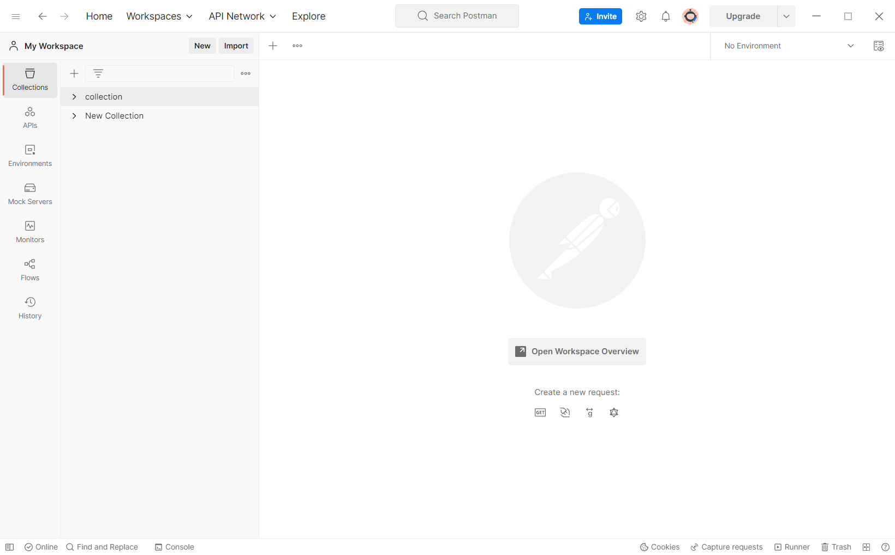
2. Выберете HTTP Request.
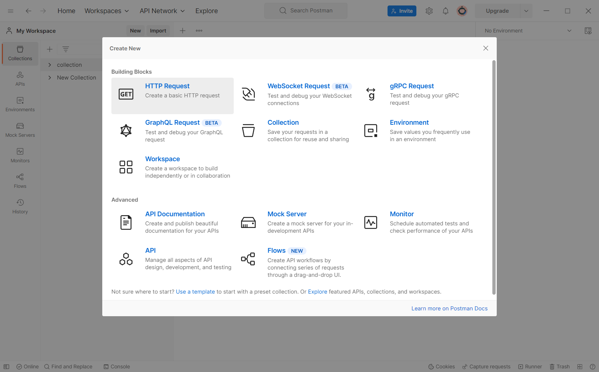
3. Введите адрес localhost:8080/number (Тут вы уже можете делать GET запрос)
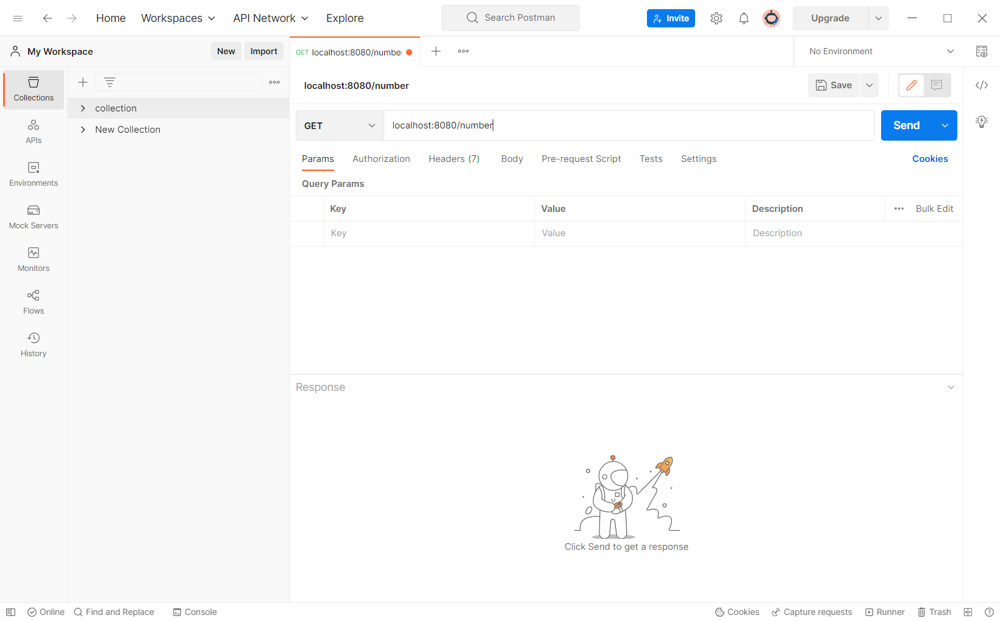
4. А вот так можно сделать PUT запрос
```
{
    "number": 2
}
```
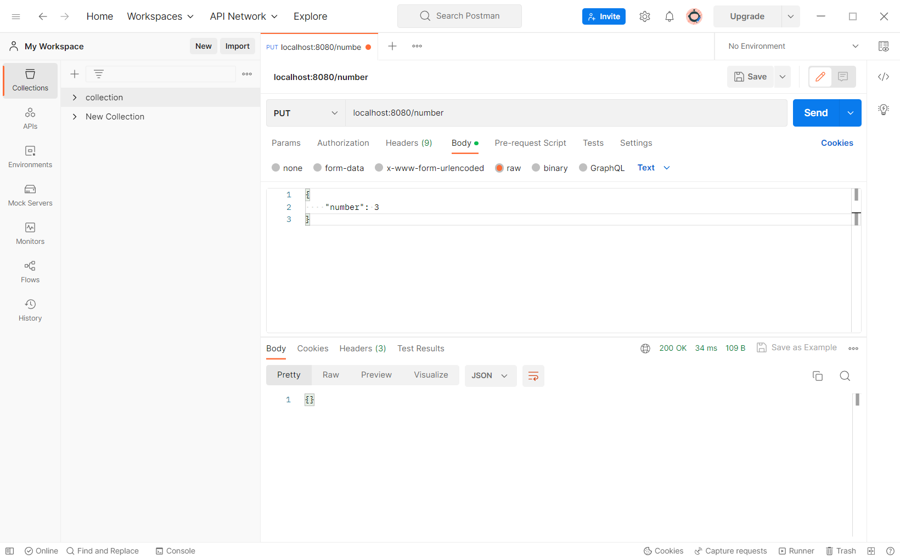
# Заросы gRPC через Postman
1. Нажмите на New.
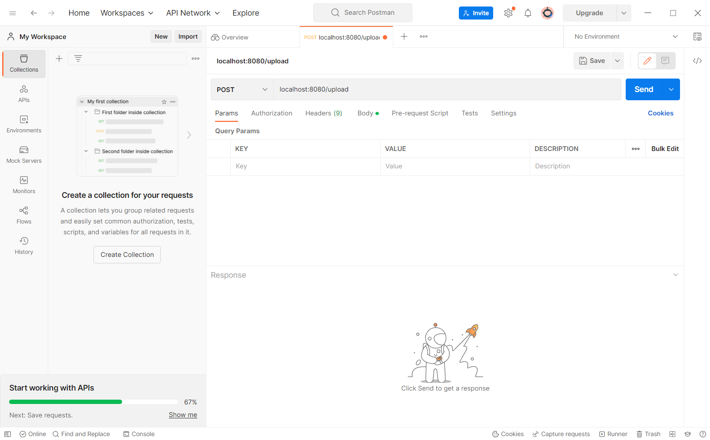
2. Выберете gRPC Request.
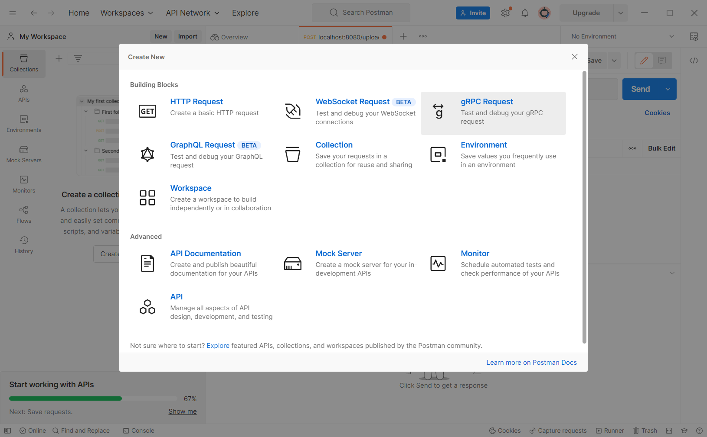
3. Дальше import .proto file
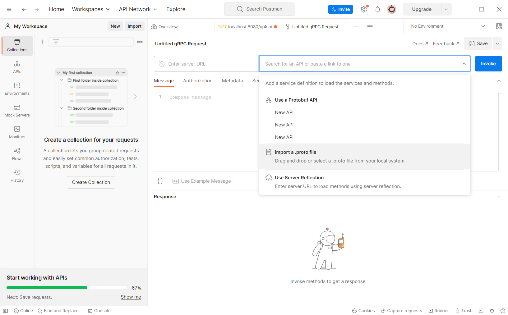
4. Выберете number_storage.proto
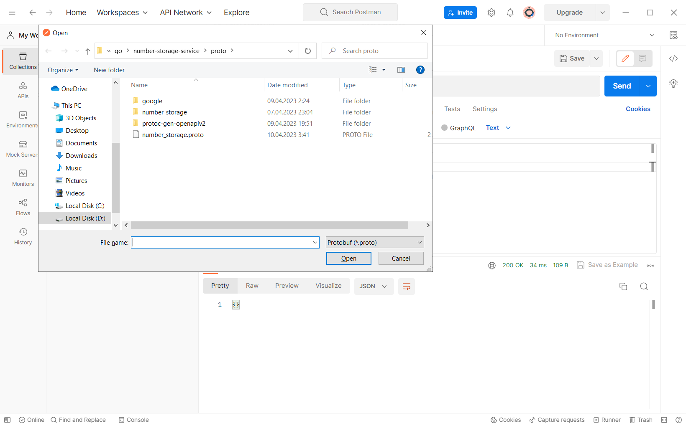
5. Если будет ругаться нажмите на + Add import path
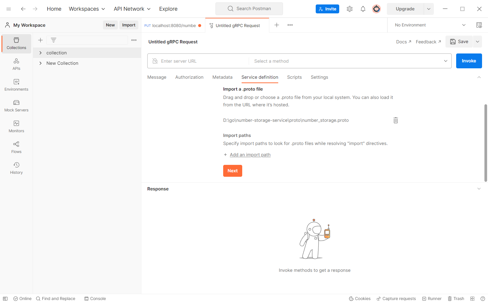
6. Укажите путь к /proto папке.
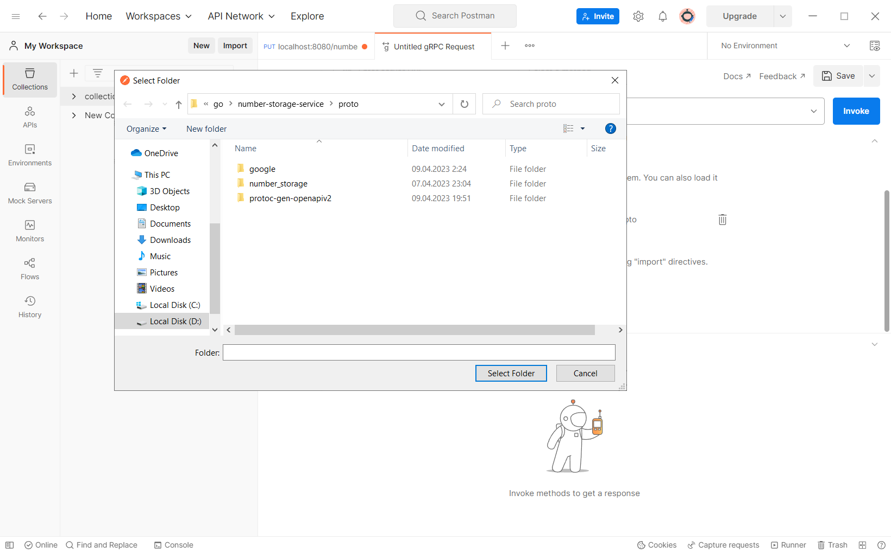
7. Нажмите import as API
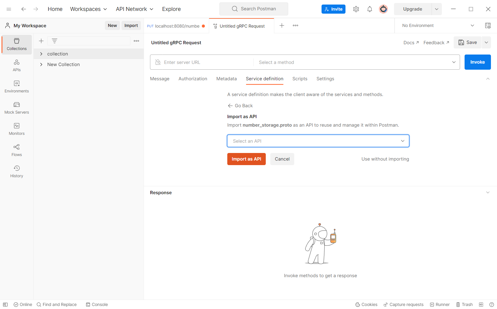
8. Укажите в качесте хоста localhost:50051
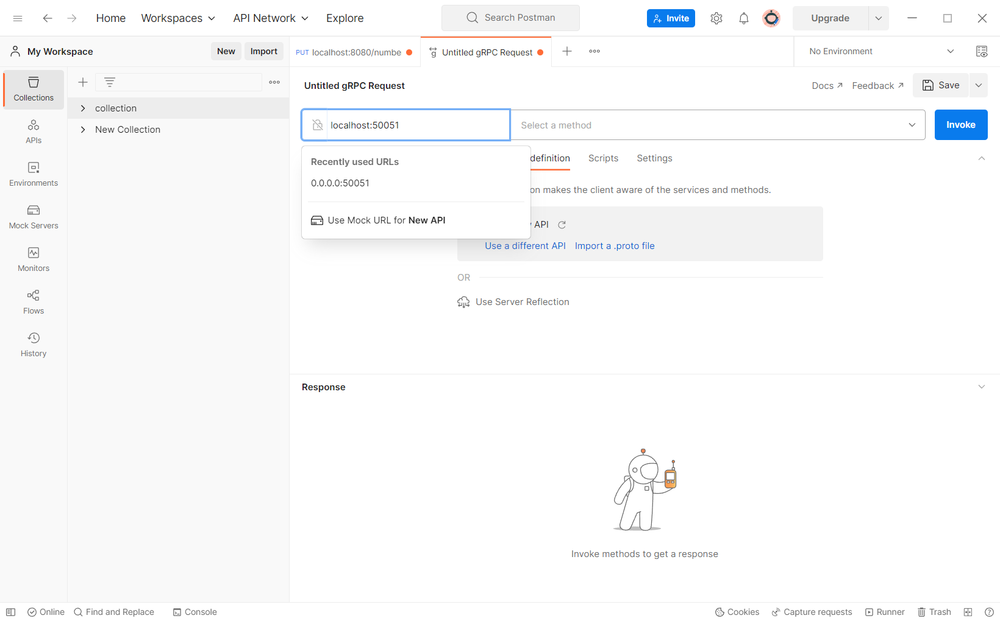
9. Пример запроса GetNumber()
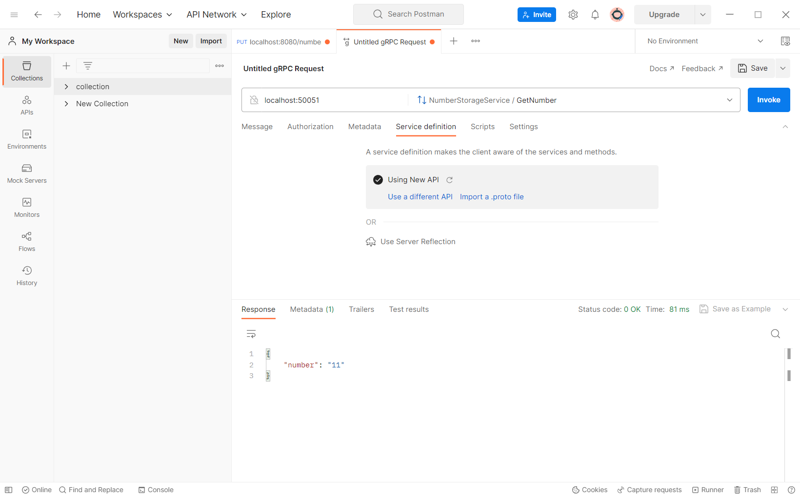
10. Пример запроса UpdateNumber()
```
{
    "number": 2
}
```
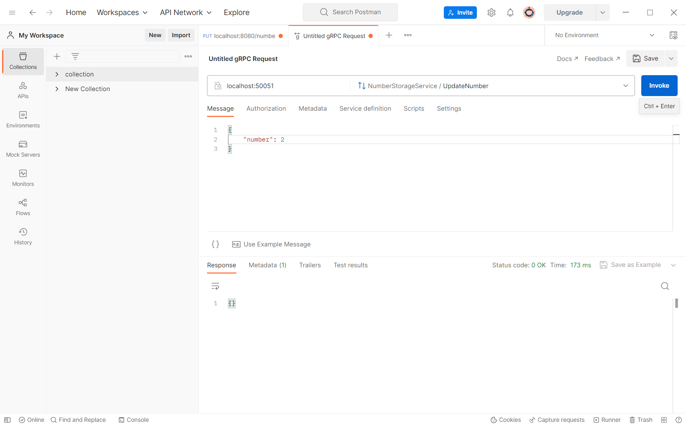